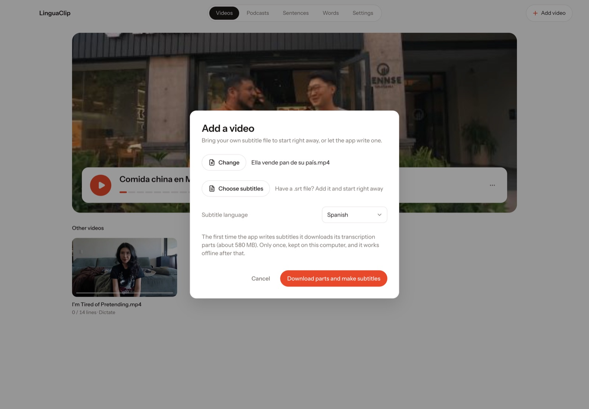
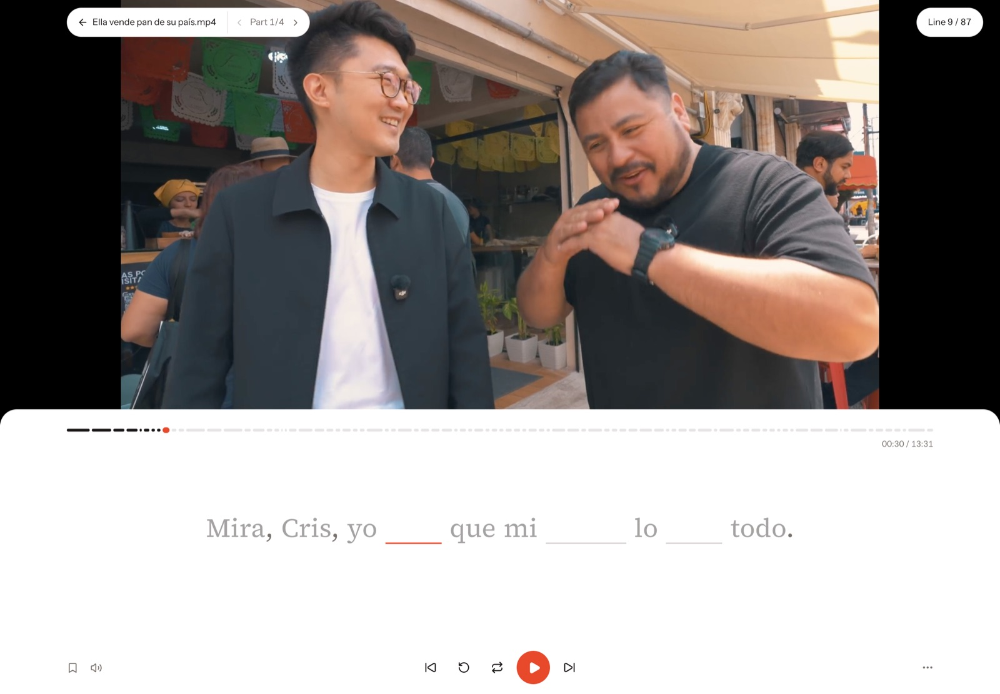
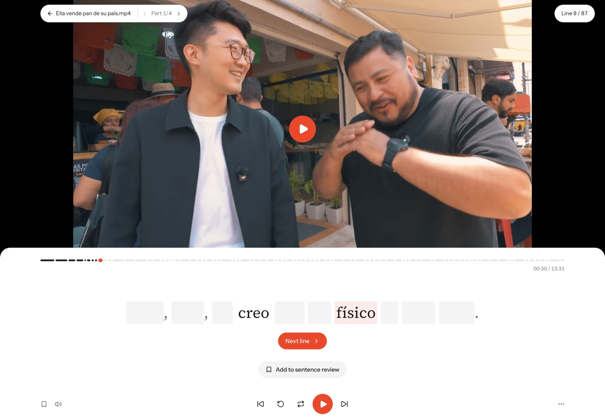
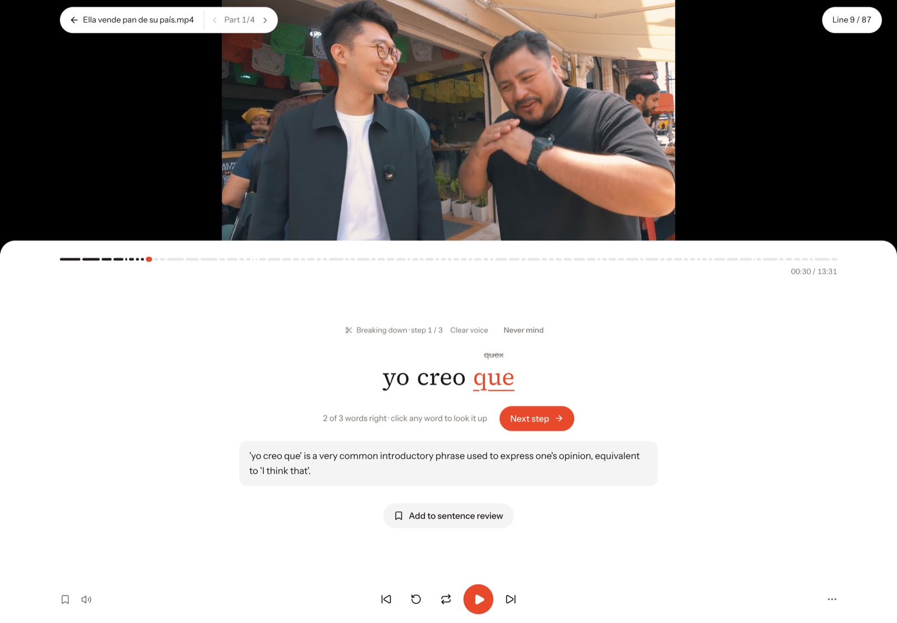
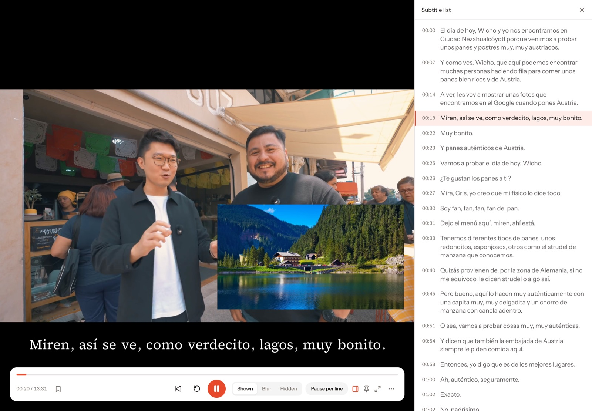
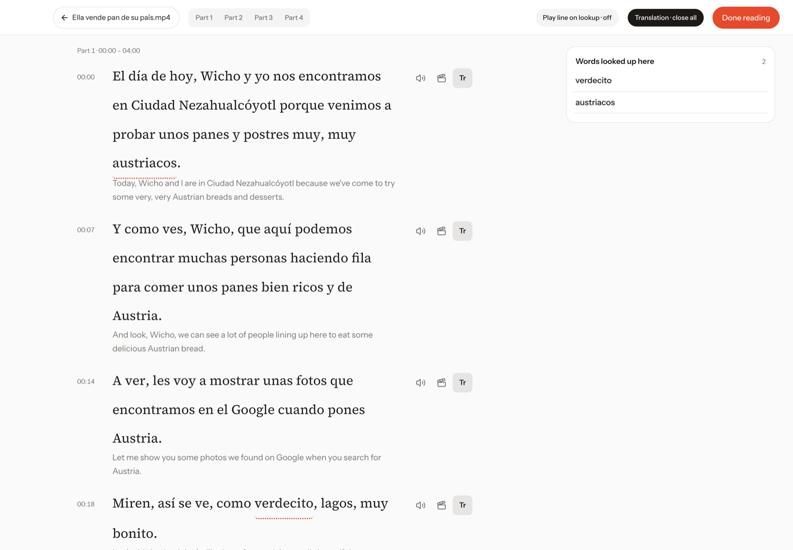
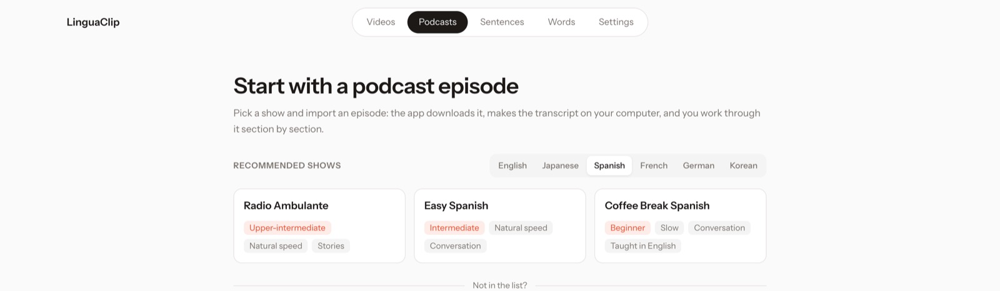
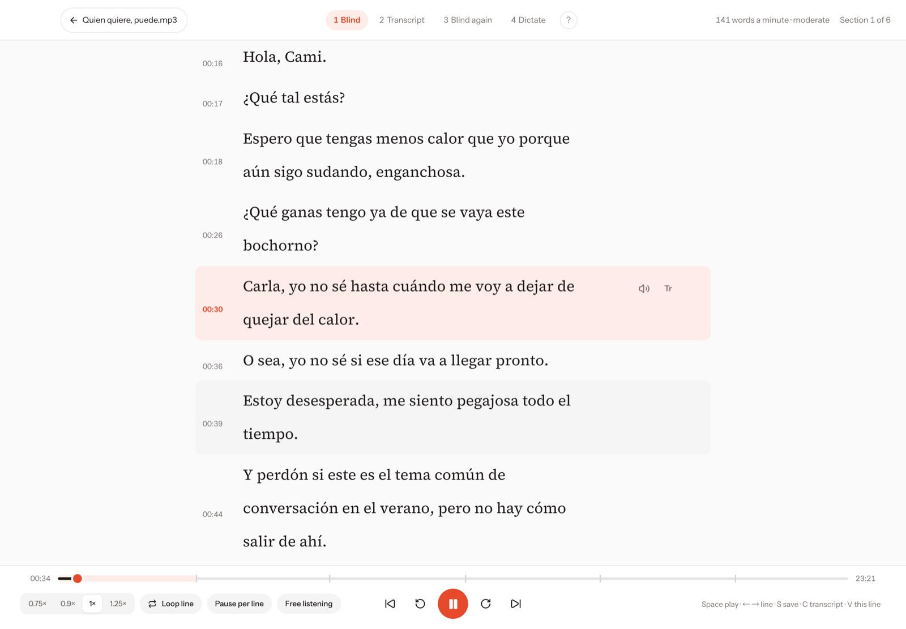
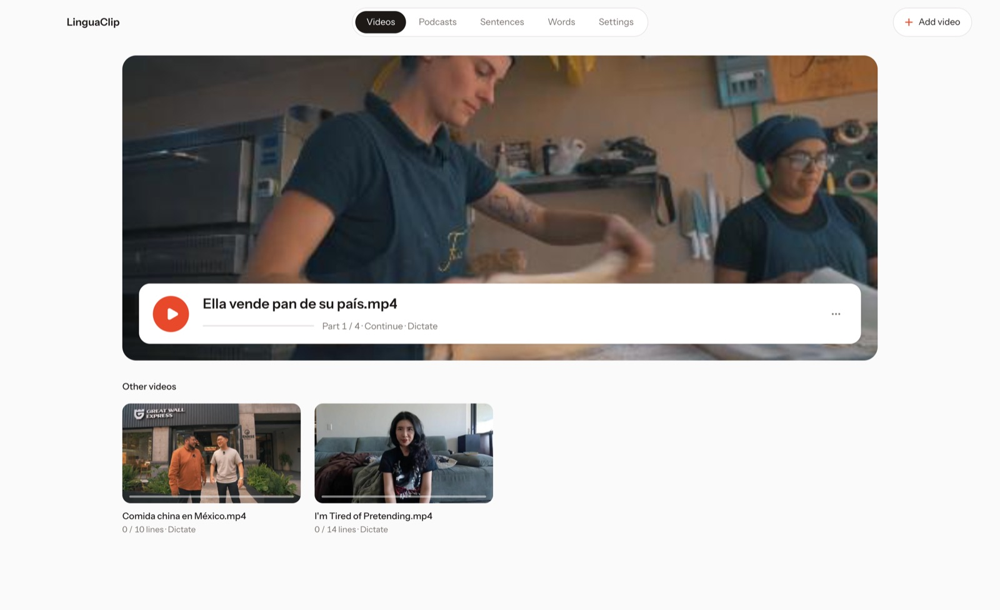

<div align="center">

# LinguaClip

**Train your ear with the videos you actually want to watch.**

A desktop app for Mac and Windows. Drop in any video, get subtitles made on your own computer, then listen and type it out one line at a time.

[Download](https://github.com/Samuelxiaozhuofeng/LinguaClip/releases) · [Website](https://linguaclipapp.com) · [中文说明](#中文说明)

If LinguaClip helps your listening, a ⭐ on GitHub helps other learners find it.

Free, no account, no limits. Fully open source ([AGPL-3.0](LICENSE)).


</div>

## Why

Watching with subtitles feels like progress, but your eyes do the work, not your ears. Dictation is the old, reliable fix: you hear a line and type it, and every gap in your listening shows up right away. LinguaClip turns any video or podcast into dictation practice, so you can train on the shows, vlogs and interviews you already enjoy.

Works with any language the subtitles are in. Spanish, English, Japanese, French and German are the most tested. The app itself is in English and Chinese.

## What it does

### Dictate line by line


The video plays one line, then waits for you to type it. Words you get right move you on by themselves. Press Enter to check the line: wrong words are underlined and your version is shown above them. Replay a line, slow it down, or loop it as many times as you need.

### Subtitles made for you, locally



Have an `.srt`? Add it and start right away. No subtitles? LinguaClip transcribes the video on your computer with whisper. It downloads the parts once (about 580 MB) and works offline after that. On a Mac you can also paste a YouTube link.

### Pick how hard it is

| Easy blanks | Blur mode |
|---|---|
|  |  |
| **Easy / Medium / Full.** On Easy you type only the 2–3 words most worth practising in each line. Medium blanks about half. Full is every word. | **Blur.** The subtitle is blurred instead. Listen first and click a word only when you can't catch it. Good for shadowing. |

### "Break it down" when a line is too fast



AI picks out the phrases and grammar worth learning in a line. You practise each piece in a clear voice first, with a short note, then catch the whole line in the original audio.

### Look up any word, send it to Anki


Click any word for a definition: Wiktionary online, your own local dictionaries (Yomitan format), or AI when you want the meaning in this exact sentence. One click turns a word or a line into an Anki card with the original audio. The card style is set up for you.

### Review what you saved

Hard lines and new words go into **Sentences** and **Words**, with a built-in spaced-repetition review. You redo the lines you missed by listening to them again.

### More ways to practise

| Watch | Read first |
|---|---|
|  |  |
| Watch the whole thing with subtitles shown, blurred or hidden. Pause at the end of each line if you like, look up words and save lines as you go. | Read the transcript before you listen, section by section, with translations and word lookup. Then go back and hear it. |

### Podcasts



Pick from recommended shows for each language and level, or paste any Apple Podcasts or RSS link. Your own mp3 files work too.



Intensive listening takes an episode one section at a time: listen blind, then with the transcript, then blind again. Afterwards, dictate the lines you marked.

### Your videos stay yours



Videos never leave your computer. No account and no upload. Practice progress is saved automatically in 4-minute sections, so you can pick up where you left off.

## Install

Requires macOS (Apple silicon or Intel) or Windows 10/11 (64-bit).

**Mac**

1. Download `LinguaClip-mac-apple-silicon.zip` (M1 or later) or `LinguaClip-mac-intel.zip` (Intel Mac) from [Releases](https://github.com/Samuelxiaozhuofeng/LinguaClip/releases), unzip it and drag it into Applications.
2. The app isn't notarized by Apple, so macOS blocks it the first time. Click Done, open **System Settings → Privacy & Security**, scroll down and click **Open Anyway**.
   If it says the app is "damaged", run this in Terminal and open it again:

   ```bash
   xattr -dr com.apple.quarantine /Applications/LinguaClip.app
   ```

**Windows**

1. Download `LinguaClip-windows-setup.exe` from [Releases](https://github.com/Samuelxiaozhuofeng/LinguaClip/releases) and run it.
2. At "Windows protected your PC", click **More info → Run anyway**.
3. Pasting YouTube links isn't supported on Windows, and transcription runs on the CPU, so it's slower than on a Mac.

The app updates itself: when a new version is out, it offers a one-click update.

### Optional extras

- **AI features:** add any OpenAI-compatible endpoint and key in **Settings → AI**. Without one you can still dictate every word, use Blur and look words up in dictionaries. Easy / Medium blanks, Break it down, AI lookup and translations need it.
- **YouTube links (Mac):** install these with [Homebrew](https://brew.sh) and a link box appears when you add a video. Please only download videos you have the right to use.

  ```bash
  brew install yt-dlp ffmpeg node
  ```

- **Anki:** install [Anki](https://apps.ankiweb.net) and the [AnkiConnect](https://ankiweb.net/shared/info/2055492159) add-on, and keep Anki open while you practise.

## FAQ

**Is it free? Do I need an account?**
Yes, everything in the app is free. No account, no sign-up.

**Does my video get uploaded anywhere?**
No. Videos stay on your computer, and subtitles are transcribed locally by default. Only if you turn on cloud transcription or AI features is text or audio sent to the service you set up.

**Why does it download about 580 MB the first time?**
That's the speech-to-text model, downloaded once when you first transcribe a video without subtitles. After that it works offline. Short on space? Pick the lighter model (about 190 MB) in **Settings → Import & transcribe**, or skip the download by adding your own `.srt`. You can also use cloud transcription (Groq or Alibaba Bailian) with your own key.

**Do I need an AI key?**
No. Full dictation, Blur mode and dictionary lookup work without one. A key unlocks Easy / Medium blanks, Break it down, AI lookup and translations.

**macOS says it can't be opened, or that it's damaged.**
The app isn't notarized by Apple yet. See step 2 under [Install](#install).

**Can I paste a YouTube link?**
On Mac, yes, after installing `yt-dlp`, `ffmpeg` and `node` (see [Optional extras](#optional-extras)). On Windows, not yet: download the video first and add the file.

**Transcription is slow on Windows.**
It runs on the CPU by default. There's an experimental GPU option in **Settings → Import & transcribe**, or use cloud transcription.

**Which languages work?**
Any language whisper can transcribe. Dictionary lookup and the extra polish are best for Spanish, English, Japanese, French and German.

**Linux?**
Not yet.

## Open source

LinguaClip is fully open source under [AGPL-3.0](LICENSE), and everything in the official app is free to use.

This project participates in and endorses the [LINUX DO](https://linux.do) community.

Build it yourself (needs Node.js and [Rust](https://www.rust-lang.org/tools/install)):

```bash
npm install
npx tauri dev
```

Package with `npx tauri build`.

---

## 中文说明

觉得有用的话，给个 ⭐ 吧，能让更多学语言的人看到它。

完全免费，不用注册，不限次数。本仓库是开源部分（AGPL-3.0）；官方安装包另带「先读字幕」和「播客」，同样免费。

**用你爱看的视频，练出真听力。** 一个 Mac / Windows 桌面听写 App：拖进任意视频，自动出字幕，一句一句听、一句一句打。

### 它能做什么

- **一句一句听写**：听一句打一句，对答案时只标出你听错的词；可重听、放慢、单句循环
- **自动出字幕**：有 .srt 直接开练；没有就在你电脑上用 whisper 识别（第一次下载约 580MB 组件，之后断网也能用）；Mac 上还能粘贴 YouTube 链接
- **挖空三档**：轻松（每句只打 2–3 个词）/ 适中（约一半）/ 全写
- **模糊模式**：字幕先糊住，听不出来再点开看，适合跟读
- **拆开教我**：AI 挑出这句里值得学的搭配和语法，先听清晰朗读一块块练，再回到原声里把它听出来
- **点词就查**：在线词典、本地词典（Yomitan 格式）或 AI 按语境解释；一键做成带原声的 Anki 卡
- **句子 / 单词复习**：收藏的难句和生词按间隔重复自动排期
- **看剧**：整集看，字幕可显示 / 模糊 / 隐藏，边看边查词、收藏
- **先读字幕**：先分段读原文（带译文和查词），再去听
- **播客精听**：各语言、各难度的推荐节目，或粘贴 Apple Podcasts / RSS 链接；按「盲听 → 看稿听 → 再盲听」一段段过
- **视频只存在你自己的电脑上**：不上传、不用注册；按 4 分钟一段练，进度自动保存

### 安装

需要：macOS（Apple 芯片或 Intel 芯片）或 Windows 10 / 11（64 位）。

**Mac**

1. 到 [Releases](https://github.com/Samuelxiaozhuofeng/LinguaClip/releases) 下载 `LinguaClip-mac-apple-silicon.zip`（M1 及以后）或 `LinguaClip-mac-intel.zip`（Intel 芯片的 Mac），解压后拖进「应用程序」。国内下载慢可以去 [官网](https://linguaclipapp.com) 下载。
2. App 没有经过苹果付费签名，第一次打开会被拦下。点「完成」，打开「系统设置 → 隐私与安全性」，拉到底点「仍要打开」。
   如果提示「已损坏，无法打开」，打开「终端」运行下面这行再双击：

   ```bash
   xattr -dr com.apple.quarantine /Applications/LinguaClip.app
   ```

**Windows**

1. 到 [Releases](https://github.com/Samuelxiaozhuofeng/LinguaClip/releases) 下载 `LinguaClip-windows-setup.exe`，双击安装。
2. 安装包没有付费签名，会弹出「Windows 已保护你的电脑」：点「更多信息」→「仍要运行」。
3. Windows 版不支持粘贴 YouTube 链接；字幕识别用 CPU，比 Mac 慢一些。

有新版本时 App 会提示一键更新。

### 可选

- **AI 功能**：「设置 → AI」里填任意 OpenAI 兼容接口的地址和 key。不填也能用全写听写、模糊模式和词典查词；挖空的轻松 / 适中档、拆开教我、AI 查词和译文需要 AI。
- **YouTube 链接（只限 Mac）**：用 [Homebrew](https://brew.sh) 装好 `brew install yt-dlp ffmpeg node`，添加视频的弹窗里就会出现网址框。第一次下载会让你在 App 里登录 YouTube。请只下载你有权使用的视频。
- **Anki**：装好 [Anki](https://apps.ankiweb.net) 和 [AnkiConnect](https://ankiweb.net/shared/info/2055492159) 插件，练习时开着 Anki 就能一键加卡。

### 常见问题

- **要钱吗？要注册吗？** 官方 App 里的功能全部免费，不用注册账号。
- **视频会上传吗？** 不会。视频只在你电脑上，字幕默认在本机识别。只有你自己开了云端转录或 AI 功能，才会把文字或声音发给你填的那家服务。
- **为什么第一次要下载约 580MB？** 那是语音识别模型，只在第一次给没字幕的视频生成字幕时下载一次，之后断网也能用。空间紧可以在「设置 → 导入与转录」换轻量模型（约 190MB），或直接添加自带的 `.srt` 不下载；也可以用云端转录（Groq / 阿里云百炼，自填密钥）。
- **必须填 AI key 吗？** 不用。全写听写、模糊模式、词典查词都不需要；挖空的轻松 / 适中档、拆开教我、AI 查词和译文才需要。
- **Mac 提示无法打开 / 已损坏？** App 还没经过苹果公证，按上面「安装」第 2 步操作。
- **能粘贴 YouTube 链接吗？** Mac 可以，先装好 `yt-dlp`、`ffmpeg`、`node`（见「可选」）；Windows 暂不支持，先把视频下载下来再添加。
- **Windows 上识别字幕很慢？** 默认用 CPU。「设置 → 导入与转录」里有实验性的显卡加速，或改用云端转录。
- **支持哪些语言？** whisper 能识别的语言都能练；查词和细节打磨最好的是西、英、日、法、德。
- **有 Linux 版吗？** 暂时没有。

### 开源

LinguaClip 完全开源，协议 [AGPL-3.0](LICENSE)：可以自由使用、修改、分发；改过的版本（包括做成网络服务）也要以同样协议开源。官方 App 里的功能全部免费。

本项目积极参与并认可 [LINUX DO 社区](https://linux.do)。

从源码运行需要 Node.js 和 [Rust](https://www.rust-lang.org/tools/install)：`npm install` 后 `npx tauri dev`，打包用 `npx tauri build`。
